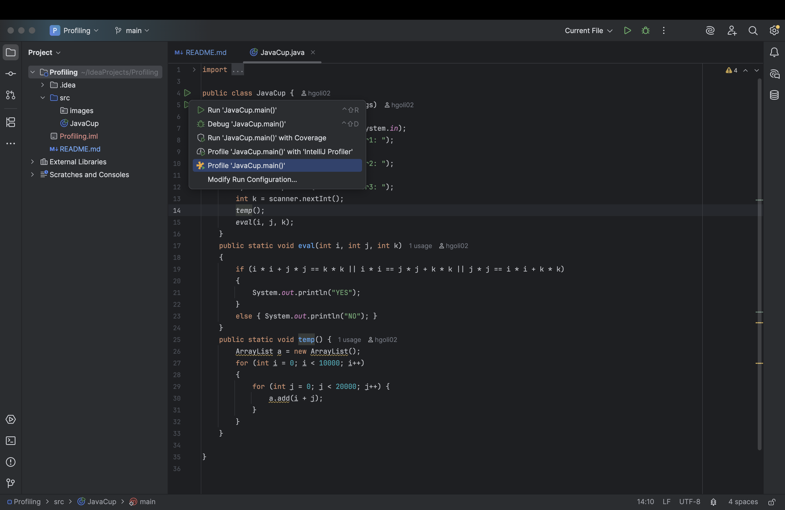
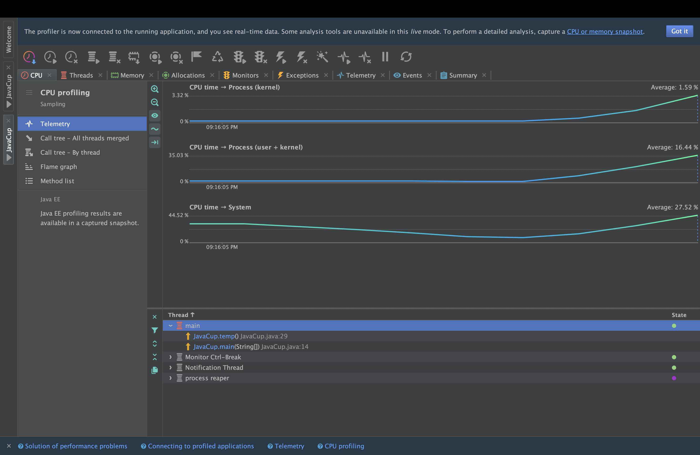
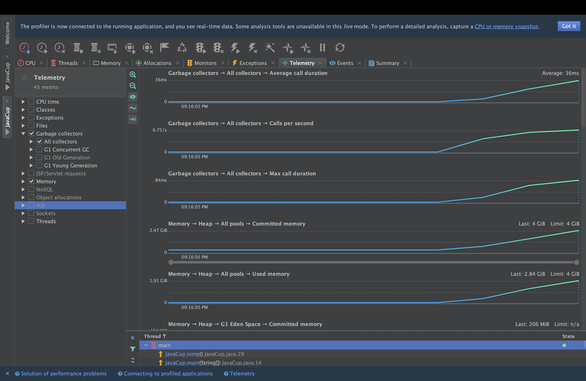
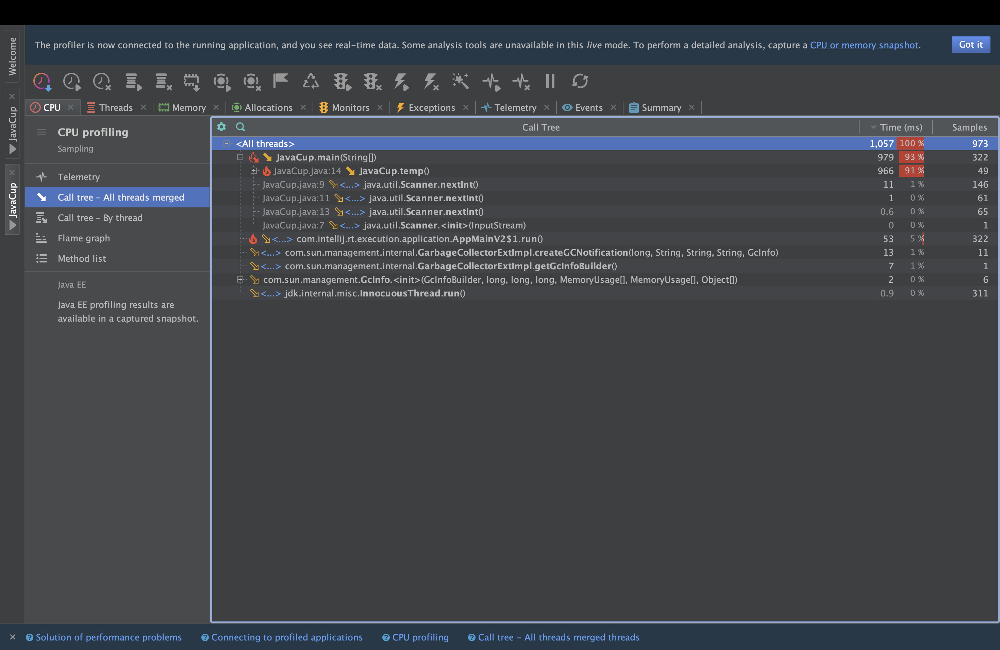
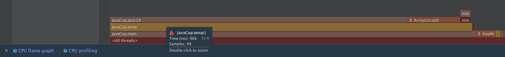
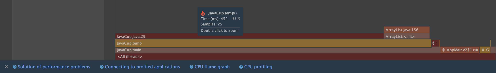

# آزمایش Profiling
## بخش اول: شناسایی قطعه کد پر مصرف
ابتدا مطابق با توضیحات داکیومنت داده شده ابزار yourkit را نصب می کنیم و plugin های لازم را تنظیم می کنیم.
برای اجرا کد کافی است با نگه داشتن نشانگر موس بر روی run گزینه profiling را انتخاب کنیم.


ابتدا برای بخش اول برنامه javacup را اجرا می کنیم و گزارش profiling مطابق زیر بررسی می کنیم.



برای بررسی دقیق و خط به خط به Call Tree می رویم و مطابق زیر می توان دید کدام بخش کد مشکل ساز است:

همچنین تب methods بر اساس تابع های مختلف این امکان را به ما نیز می دهد:


همانطور که در گزارش yourkit مشاهده می‌کنیم بخش مشکل ساز در کد قطعه کد زیر است.

```java
public static void temp() {
    ArrayList a = new ArrayList();
    for (int i = 0; i < 10000; i++)
    {
    for (int j = 0; j < 20000; j++) {
    a.add(i + j);
        }
    }
}
```


مشکل اصلی این است که یک ArrayList ساخته شده ولی مقدار آن مشخص نشده و از آنجا که ArrayList ها داینامیک هستند در هر iteration سایز آن بزرگ می شود (به صورت amortized O(1))
برای حل این مشکل کد را به شکل زیر تغییر داده و سایز آن که استاتیک است و از قبل می دانیم را ست میکنیم تا هزینه ای برای دو برابر شدن سایز ArrayList ندهیم.
   
```java
public static void temp() {
        ArrayList<Integer> a = new ArrayList<>(10000 * 20000);
        for (int i = 0; i < 10000; i++)
        {
            for (int j = 0; j < 20000; j++) {
                a.add(i + j);
            }
        }
    }
```


حال برای مقایسه عملکرد می توانیم FlameGraph هارا مقایسه کنیم:



همانطور که میبینیم کد بهبود یافته است و لود اصلی به جای اینکه در هر عملیات add باشد به روی عملیات ساختن arraylist منتقل شده است که البته باز بهتر از حالت قبلی است.

## پیاده سازی یک الگوریتم دلخواه و بهبود آن

در این بخش ما الگوریتم ضرب دو ماتریس را انتخاب کردیم

قطعه کد اولیه به صورت زیر است:

```java
import java.util.Random;

public class MatrixMultiply {

    public static void main(String[] args) {
        int size = 1024;
        int[][] A = new int[size][size];
        int[][] B = new int[size][size];
        int[][] C = new int[size][size];

        Random rand = new Random();

        for (int i = 0; i < size; i++) {
            for (int j = 0; j < size; j++) {
                A[i][j] = rand.nextInt(100);
                B[i][j] = rand.nextInt(100);
            }
        }

        for (int i = 0; i < size; i++) {
            for (int j = 0; j < size; j++) {
                for (int k = 0; k < size; k++) {
                    C[i][j] += A[i][k] * B[k][j];
                }
            }
        }

        System.out.println("Multiplication complete.");
    }
}
```

مشکل اصلی این قطعه کد در لوپ ضرب کردن می باشد

برای بهود آن از ایده زیر استفاده میکنم:
